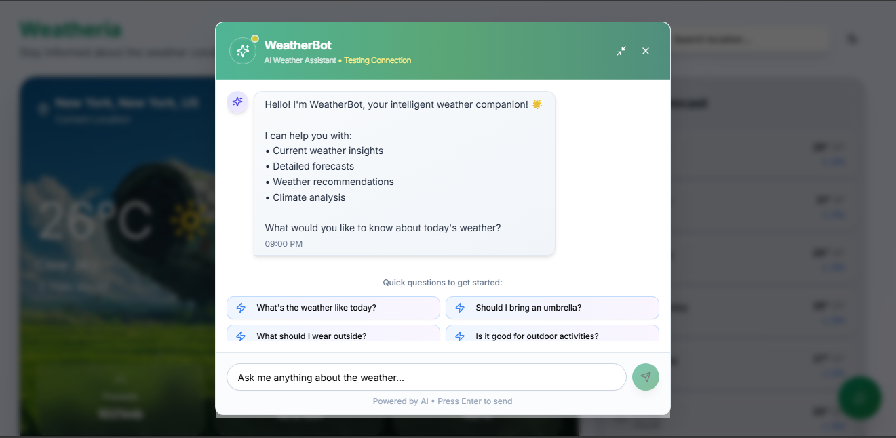
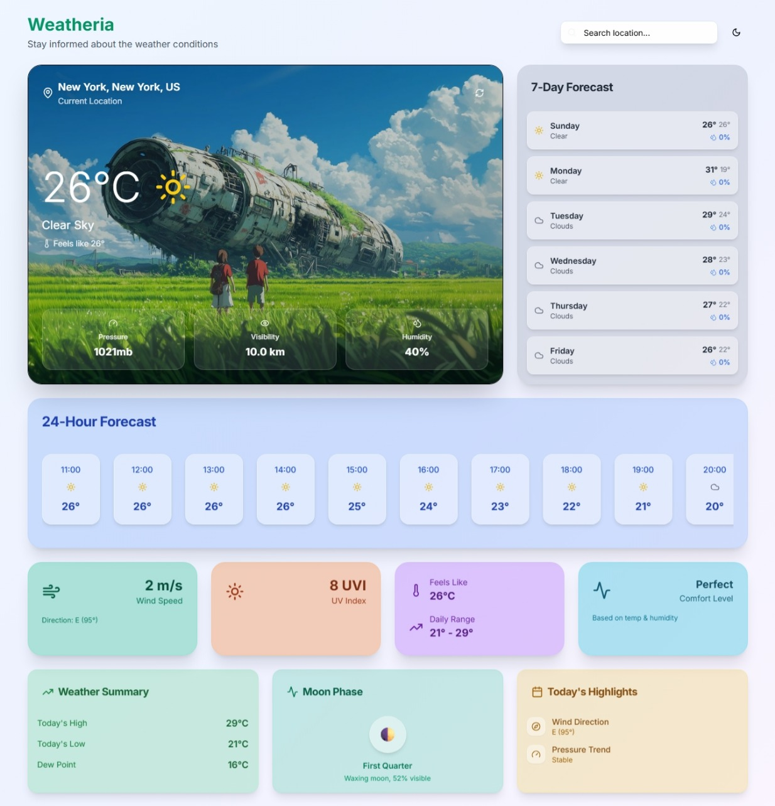

# Weatheria

Stay informed about the weather conditions with **Weatheria** – your intelligent weather companion.

## Overview

Weatheria is a modern weather application designed for easy access to real-time weather data, forecasts, and recommendations. With a visually appealing interface and a unique AI-powered WeatherBot, Weatheria helps you plan your day, prepare for upcoming weather, and make informed decisions.

## Features

### 1. AI-Powered WeatherBot Assistant

- **Conversational Weather Guidance:** Instantly chat with WeatherBot to get answers to weather-related questions.
- **Instant Insights:** Ask about current conditions, forecasts, or specific advice like "Should I bring an umbrella?" or "Is it good for outdoor activities?"
- **Personalized Recommendations:** WeatherBot analyzes data to recommend clothing, travel tips, and activity suitability.
- **Quick-Ask Buttons:** Start with suggested questions for rapid access to vital information.
- **Climate Analysis:** Get deeper insights into weather trends and comfort levels.

### 2. Dynamic Homepage Experience

- **Current Location Overview:** Displays temperature, sky condition, pressure, visibility, and humidity.
- **Background Imagery:** Engaging visuals matched with weather conditions.
- **Search Functionality:** Instantly find weather data for any location.

### 3. Detailed Forecasts

- **24-Hour Forecast:** Hourly breakdowns of temperature, weather conditions, and comfort levels.
- **7-Day Forecast:** Extended predictions for the week, including high/low temps and precipitation chances.

### 4. Weather Metrics and Highlights

- **Advanced Metrics:** See wind speed, direction, UV index, dew point, and comfort level.
- **Daily Summary:** Today's high, low, dew point, and pressure trend.
- **Moon Phase:** Track lunar cycle and visibility for enthusiasts.

## How It Works

1. **Homepage Dashboard:** Upon opening, Weatheria displays a summary of your local weather, including all critical metrics.
2. **Forecast Panels:** View hourly and weekly forecasts in organized, visually distinct sections.
3. **WeatherBot Chat:** Access the chatbot for personalized advice, forecasts, and weather insights. Use quick-ask buttons or type your questions.
4. **Recommendations:** Weatheria highlights actionable advice and comfort ratings based on live weather data.
5. **Location Search:** Quickly switch between locations to see weather anywhere.

## Example Use Cases

- **Daily Planning:** Check hourly forecasts and comfort ratings before leaving home.
- **Travel Prep:** Use the 7-day forecast and WeatherBot’s recommendations to pack and plan.
- **Outdoor Activities:** Get wind speed, UV index, and expert advice for safe outings.
- **Curiosity:** Ask WeatherBot questions about weather trends, climate, and moon phases.

## Getting Started

1. Clone the repository.
2. Install dependencies according to the project documentation.
3. Run the application and enter your location to begin.

## Contributing

Contributions are welcome! Please refer to the project’s guidelines in the documentation.

## License

See the `LICENSE` file for details.

---

Weatheria – Stay informed, stay prepared, and get weather answers in a conversation.
